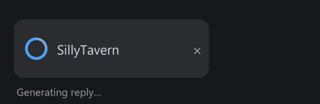

# MYTURN

A tiny SillyTavern extension that turns your **browser tab icon** into a status light, so you know when it's your turn again.



- 🔵 **Spinner** while the LLM is generating a reply
- ✅ **Green checkmark** when it finishes — and it **stays put until you return to the tab**
- ↩️ Reverts to the normal favicon the moment you click back

Tab away to do other things and just glance at the tab — MYTURN tells you when the bot is done.

## Features

- **Zero core edits.** Uses SillyTavern's official `GENERATION_STARTED` / `GENERATION_ENDED` / `GENERATION_STOPPED` events, so core updates won't break it.
- **No image files.** Icons are drawn on a `<canvas>` at runtime — nothing to ship or get blurry.
- Works for normal sends, swipes, regenerates, impersonation, and group chats (all go through the same events).
- **Checkmark persists until you revisit the tab** by default — no guessing whether you missed it. Optionally auto-hide it after X seconds instead.
- Small settings panel: enable/disable, "only when the tab is in the background", and the auto-hide option.

## Installation

**Easiest — install from URL inside SillyTavern:**
1. Open SillyTavern → **Extensions** (the stacked-blocks icon) → **Install extension**.
2. Paste: `https://github.com/Blooshoo/MYTURN`
3. Confirm, then refresh.

**Manual:**
Copy this folder into:
```
SillyTavern/data/<your-user>/extensions/MYTURN/
```
Then refresh SillyTavern. Configure it under **Extensions → MYTURN**.

> Note: the folder must be named `MYTURN` so the settings panel template loads correctly.

## Notes

- Spinner animation on a favicon works in Chromium browsers (Brave, Chrome, Edge). Some browsers throttle background-tab timers, which only slows the spin — the start/done states still work.
- The checkmark is intentionally skipped if you're already looking at the tab when generation ends; it only shows when the tab is in the background, where it's actually useful.

## License

MIT — do whatever you like.
